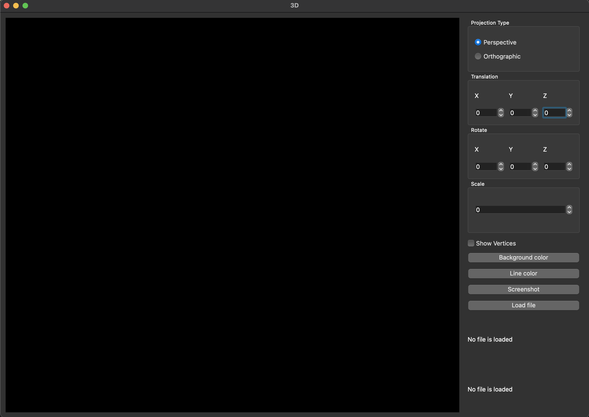

# 3D Viewer v1.0

## Contents

0. [Installation](#installation)
1. [3DViewer](#3dviewer)
2. [Selection a file](#loading)
3. [Camera operations](#opers)
4. [Model operations](#mopers)
5. [Model info](#info)
6. [Choosing projection type](#proj)
7. [Coloring](#color)

## Installation

Go to source folder from terminal and run command:
> make install

App is in the 3DViewer folder and named "OpenGLApp"

## 3DViewer

## Loading a model

<!--  -->

Push "Load file" button, then show path to your "OBJ" formatted file

## Camera operations

Target of camera can be moved with keys (W, S, A, D).

Position of camera can be changed with mouse moving with pressed right button of the mouse

## Model operations

<!--  -->

Above instruments to translate/rotate on X/Y/Z axes and scaling.

## Model info

<!--  -->

Above field with loaded model info (path, number of vertices and edges)

## Choosing projection type

<!--  -->

Above you can choose type of projection

## Coloring

<!--  -->

Field to choose background and edges colors, also checkbox for highlighting vertices